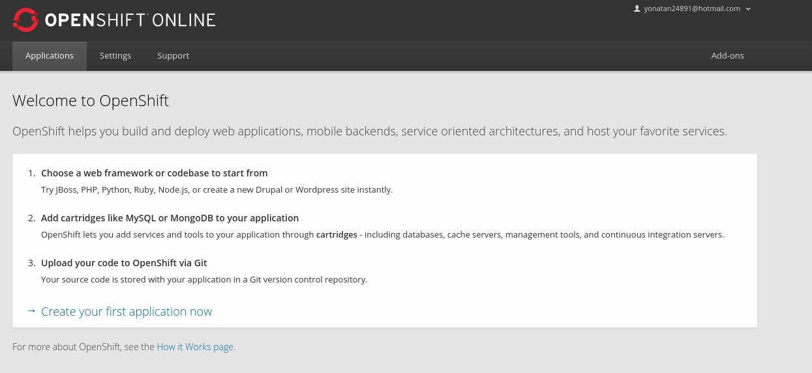
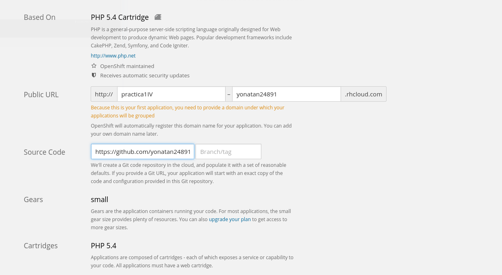

Practica1IV
===========
Plataforma:

He realizado la practica en OpenShift.

Nos permite trabajar con Java,PHP,Ruby,Node.js,Python,Perl,MySQL,MongoDB,PostgreSQL y nos permite instalar los principales cms como Wordpress,Drupal o joomla. Tambien nos permite trabajar con frameworks que se apoyen en esas tecnologias.

Como se aprecia es una solucion muy completa, y de forma gratuita nos permite tener hasta 3 proyectos funcionando simultaneamente.

OpenShift es una plataforma que nos provee servicios PaaS propiedad de RedHat.

Despliegue:

He utilizado el código de una página web de la asignatura TW del año pasado
Creamos la cuenta en OpenShift, ponemos nombre a nuestra aplicación y elegimos que será en php y creamos.

